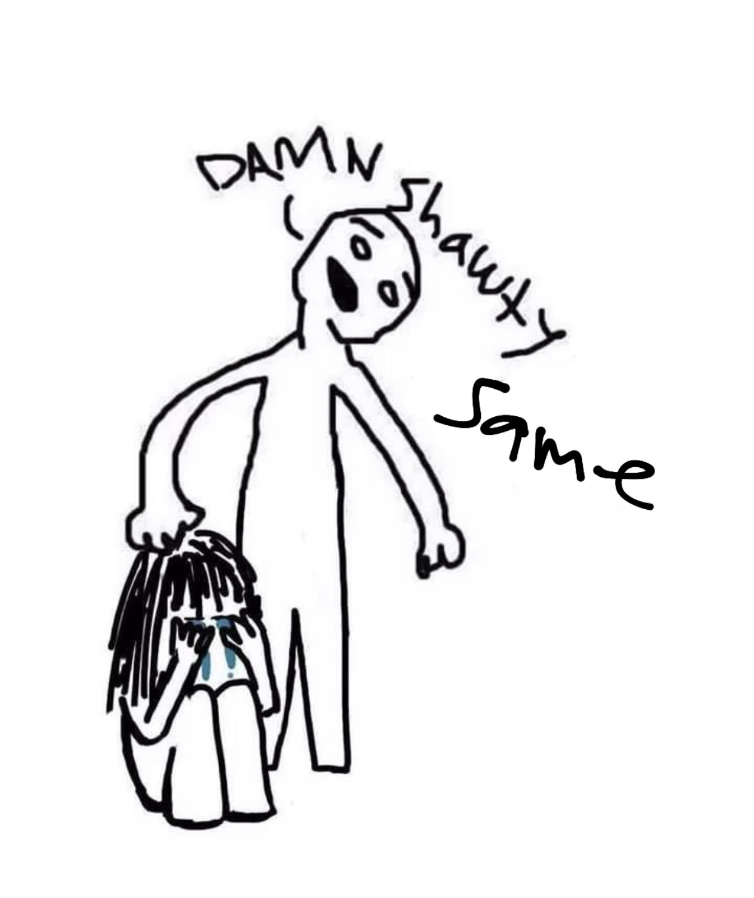
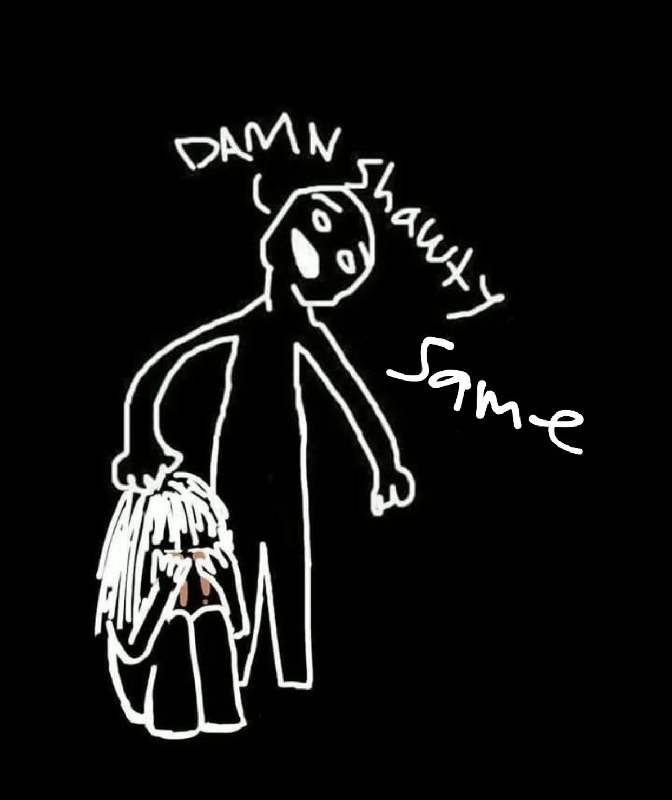
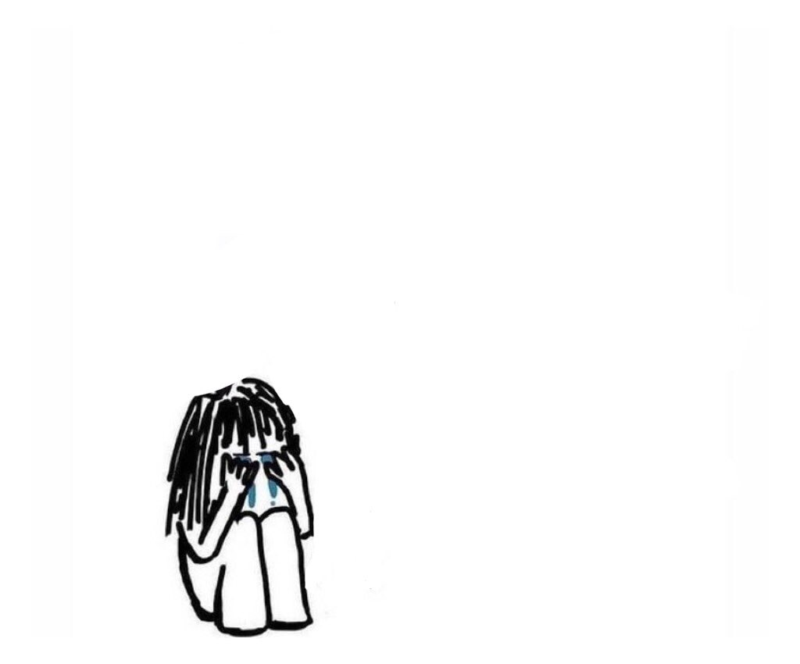
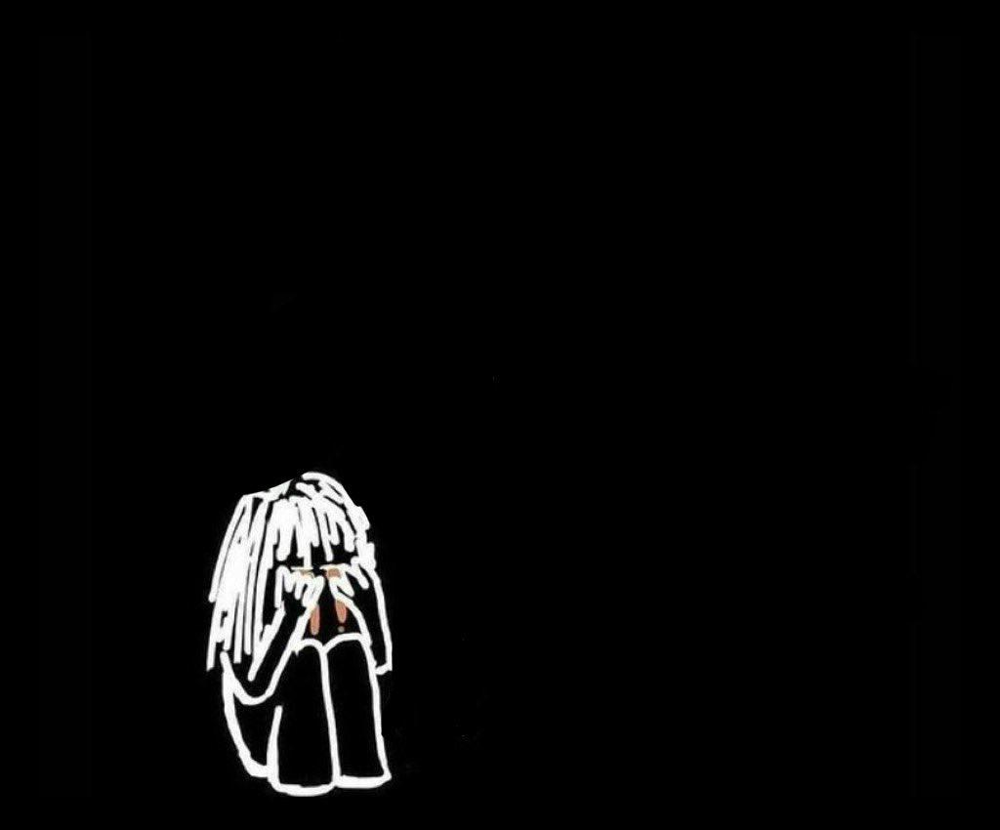
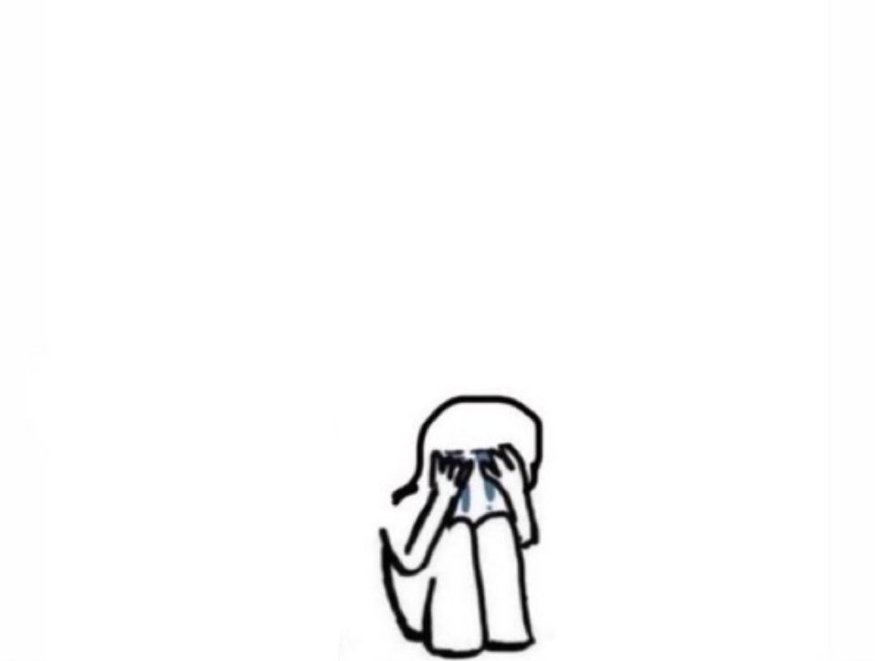
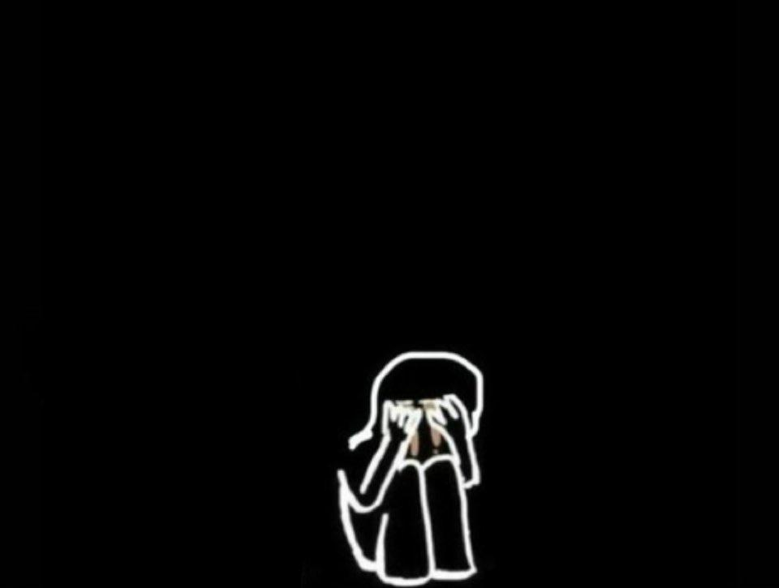
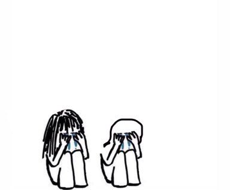
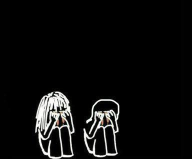
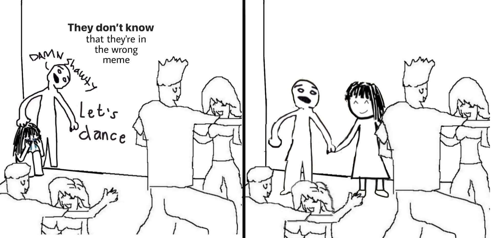
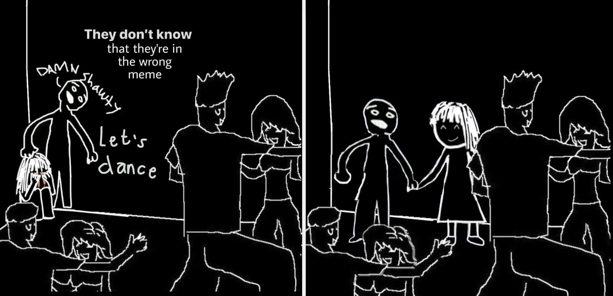

# White to Black

Code to convert meme templates to dark mode. Comments aid in the `white-to-black.py` comprehending the code.

In case of further queries connect with me on [Twitter](https://twitter.com/masaaldosey).

## Sample Images
**Original**               |  **Converted**
:-------------------------:|:-------------------------:
|   |   |
|   |   |
|   |   |
|   |   |
|   |   |
